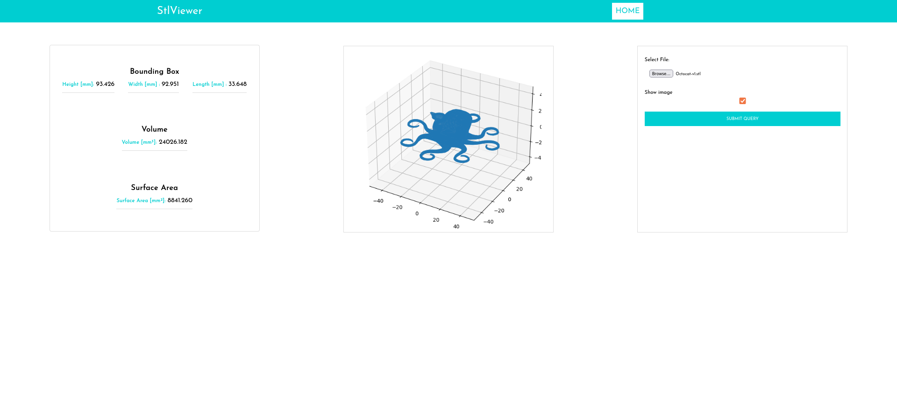

# StlViewer App

## Features

- Django RestFramework 3.12.4
- Django==3.2.7
- PostgreSQL database support with psycopg2.
- ReactJs, Redux, Css

## Appview

## Usage

After successfully running the application, select a file with an extension of ".stl". If you want to see the three-dimensional view of the relevant file, please be sure that the checkbox is checked.
After successfully uploading the file, press submit button, then the results will be shown on. ".STL" files don't contain units, therefore I have accepted 1 unit as 1mm for extraction of data.

.

## Getting Started

Firstly, download the codes from the repository or email, then run the following command.

```

$ cd Django_React_Stlviewer_App

```

Create a virtual environment by running the following command.

```
$ python3 -m venv venv

```

Activate the virtualenv for your project.

```
$ source venv/bin/activate

```

Install project dependencies:

```
$ pip install -r requirements.txt

```

Postgresql Configuration: First create a table by running the following command on the command line.
If you don't have Postgresql on your local machine, you can basically comment on this section in the "settings.py" file, continue with Django's default database 'SQlite'.You can find this configuration in the "settings.py" file with the label "DJANGO DEFAULT DATABASE".

```
$ psql

```

or

```
$ sudo -u postgres psql

```

After that, run respectively following commands

```
# CREATE USER name;
```

```
# CREATE DATABASE fileupp OWNER name;

```

Finally, update your "settings.py" and enter your password and username

```
DATABASES = {
    'default': {
        'ENGINE': 'django.db.backends.postgresql',
        'NAME': 'fileup',
        'USER': '**** #your db username',
        'PASSWORD': '***** your db password',
        'HOST': 'localhost'
    }
}

```

To install React dependencies and and also combine with Django RestFramework, firstly run;

```
$ npm install

```

Make "build" folder. By runnig following command, the "build" folder will be created inside backend folder automatically.

```
$ npm  run build

```

To make migrations, go inside backend directory by running following command;

```
$ cd backend

```

After that, run following command;

```
$ python  manage.py makemigrations

```

After making migrations successfully, run following command to create table

```
$ python manage.py migrate

```

Now, you can start the Django development server

```
$ python manage.py runserver

```

If you want to test "url.py" and "views.py" files, please run following command:

```
$ python manage.py  test

```

## Licence

MIT

Copyright (c)

Permission is hereby granted, free of charge, to any person obtaining a copy of this software and associated documentation files (the "Software"),
to deal in the Software without restriction, including without limitation the rights to use, copy, modify, merge, publish, distribute, sublicense, and/or sell copies of the Software, and to permit persons to whom the Software is furnished to do so, subject to the following conditions:

The above copyright notice and this permission notice shall be included in all copies or substantial portions of the Software.

THE SOFTWARE IS PROVIDED "AS IS", WITHOUT WARRANTY OF ANY KIND, EXPRESS OR IMPLIED, INCLUDING BUT NOT LIMITED TO THE WARRANTIES OF MERCHANTABILITY,
FITNESS FOR A PARTICULAR PURPOSE AND NONINFRINGEMENT. IN NO EVENT SHALL THE AUTHORS OR COPYRIGHT HOLDERS BE LIABLE FOR ANY CLAIM, DAMAGES OR OTHER LIABILITY, WHETHER IN AN ACTION OF CONTRACT,
TORT OR OTHERWISE, ARISING FROM, OUT OF OR IN CONNECTION WITH THE SOFTWARE OR THE USE OR OTHER DEALINGS IN THE SOFTWARE.
